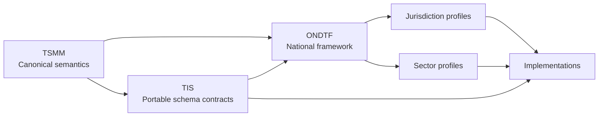

# Open National Digital Trust Framework (ONDTF)

[](https://sankarshanmukhopadhyay.github.io/open-national-digital-trust-framework/)
[](RELEASE_NOTES.md)
[](CHANGELOG.md)

The **Open National Digital Trust Framework (ONDTF)** is a jurisdiction-neutral, multi-sector reference framework for governing, implementing, assuring, and interoperating digital trust infrastructure.

ONDTF treats trust as an operational system property. It connects identity, authority, policy, evidence, assurance, decision, effect, accountability, and redress without requiring a single identity system, credential format, registry, protocol, or technology provider.

## What problem does this solve?

National digital programmes often provide identity, authentication, payments, data exchange, credentials, or registries independently. They rarely provide one coherent model for determining:

- who or what is acting;
- under whose authority;
- within which policy and jurisdiction;
- using what evidence;
- with what assurance;
- producing which attributable effect;
- and through which challenge, revocation, and remedy path.

ONDTF supplies that missing governance and architecture layer.

## Repository status

| Attribute | Value |
|---|---|
| Portfolio role | Jurisdiction-neutral national framework |
| Lifecycle | Active initial public draft |
| Current version | v0.1.0 |
| Stability | Experimental; architecture under review |
| Primary artefact | Framework, reference architecture, and profile method |
| Normative posture | Normative requirements are explicitly labelled |
| India material | Illustrative jurisdiction profile under `profiles/india/` |
| Validation | `python3 scripts/validate_repo.py` |

## Architecture relationship

ONDTF draws on, but does not duplicate or subsume, two portfolio foundations:

- **Trust Systems Meta-Model (TSMM):** canonical semantic and structural concepts for actors, roles, authority, policy, evidence, decisions, effects, lifecycle, accountability, and conformance.
- **Trust Infrastructure Schemas (TIS):** portable machine-readable contracts for exchanging and validating trust infrastructure records and evidence.

ONDTF owns the national-framework layer: governance, adoption, assurance expectations, sector and jurisdiction profiling, operational coordination, and conformance policy.



See [Portfolio alignment](docs/foundations/portfolio-alignment.md) and [Dependency policy](docs/foundations/dependency-policy.md).

## Start here

- [Policy and regulatory readers](docs/adoption/policy-reader-path.md)
- [Architects](docs/adoption/architect-reader-path.md)
- [Implementers](docs/adoption/implementer-reader-path.md)
- [Assurance and audit teams](docs/adoption/assurance-reader-path.md)
- [India profile](profiles/india/index.md)

## Ten-minute validation

```bash
gem install bundler
bundle install
python3 scripts/validate_repo.py
bundle exec jekyll build
```

## Scope boundary

ONDTF does **not** define a national identity system, mandate a credential format, create legal recognition by itself, replace sector regulators, or centralise all trust decisions in one registry. It defines the common framework within which such systems can interoperate and be governed.

## Licensing

Documentation is licensed under [CC BY-NC-SA 4.0](LICENSE). Code and executable examples may be separately licensed in later releases.
