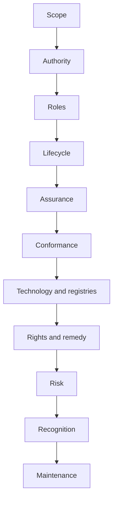

# Construction stages

The guided flow is organised into eleven stages. Branching logic may skip non-applicable questions, but no stage may be silently omitted.

| Stage | Decision focus | Principal outputs |
|---:|---|---|
| 1 | purpose, scope, harms, exclusions | charter and scope |
| 2 | authority and legitimacy | authority basis and governance |
| 3 | roles and decision rights | role catalogue and responsibility matrix |
| 4 | participation and lifecycle | admission, operation, suspension, exit |
| 5 | assurance | dimensions, levels, evidence, failure outcomes |
| 6 | conformance and accreditation | claim types, assessment, surveillance |
| 7 | technology and registries | dependency and status model |
| 8 | rights, accessibility, remedy | affected-party operating model |
| 9 | risk and adversarial conditions | risk register and control priorities |
| 10 | recognition and interoperability | recognition profile |
| 11 | maintenance and evolution | controlled-document and migration model |

A stage can be marked complete only when required decisions are resolved or explicitly accepted as a governed open issue with an authorised owner and review date.

[Previous: Guided Framework Construction](guided-framework-construction.md) · [Next: Decision States and Review Gates](decision-states-and-review-gates.md)
