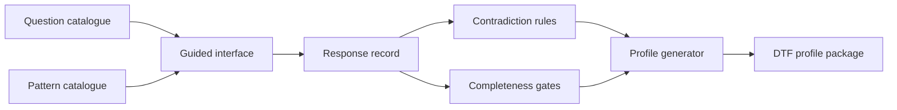

# Guided-construction model and implementation guide

The guided-construction capability is defined by machine-readable artefacts under `model/adoption/`.

| Artefact | Purpose |
|---|---|
| `construction-input-contract.yaml` | maps stable domain decisions into generated fields and review obligations |
| `question-catalogue.yaml` | defines staged questions, response types, dependencies, and mappings |
| `pattern-catalogue.yaml` | provides governed reusable design patterns and consequences |
| `contradiction-rules.yaml` | identifies inconsistent or unsafe combinations |
| `completeness-gates.yaml` | defines stage and package completion criteria |
| `construction-response.schema.json` | validates recorded responses and provenance |

An implementation may provide a web interface, command-line tool, workshop workbook, or API. It must preserve identifiers, decision states, provenance, branch logic, contradiction severity, and review gates.

[Previous: Workshop Guide](workshop-guide.md) · [Next: Profiles](../../profiles/index.md)
