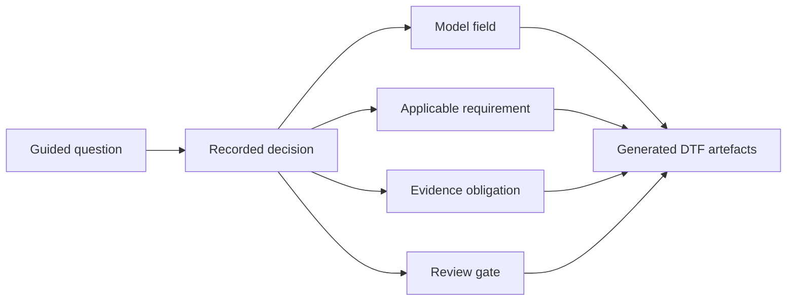

# Guided construction readiness

The provider-lifecycle and conformance models expose stable decision inputs for the planned **ONDTF Guided Framework Construction** capability. The adaptive question flow is specified separately from these domain models.

## Construction contract

`model/adoption/construction-input-contract.yaml` identifies decisions that a future guided flow must collect and maps them to generated fields, requirements, evidence and review gates. The contract currently covers:

- admission and activation authority;
- provider and service scope;
- validity and surveillance;
- material-change classification;
- restriction, suspension and withdrawal;
- continuity and exit;
- conformance claim type;
- assessment independence;
- assessor accreditation;
- evidence retention;
- appeals and public status.

## Design rule

The future generator must distinguish an adopter-supplied decision, an inherited ONDTF default, a profile-controlled choice, an unresolved decision and a matter requiring legal, technical or stakeholder review. It must not silently fill authority, liability or rights-sensitive decisions.

## Assurance and rights inputs

The construction input contract now includes structured decisions for assurance dimensions, minimum levels, critical non-compensable conditions, evidence and freshness, affected-party classes, notice, challenge, independent appeal, remedy, accessibility and alternative channels. These inputs are designed to generate both human-readable DTF sections and machine-readable profile artefacts.

