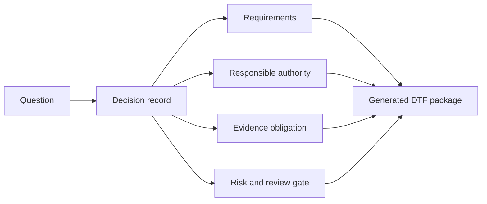

# ONDTF Guided Framework Construction

ONDTF Guided Framework Construction is a governed decision flow for producing a coherent Digital Trust Framework profile package. It is not a form-filling exercise and does not claim that institutional legitimacy, legal authority, or stakeholder consent can be generated automatically.

The flow connects each answer to the decisions, requirements, roles, evidence, risks, review gates, and artefacts that it affects.

## What the flow does

- adapts questions to earlier answers;
- offers governed patterns rather than forcing every adopter to start from a blank page;
- distinguishes selected decisions, inherited defaults, profile-controlled choices, unresolved matters, and required review;
- detects contradictions and missing dependencies;
- generates human-readable and machine-readable profile artefacts;
- preserves traceability from question to requirement and evidence;
- prevents material unresolved decisions from being presented as complete.

## What it does not do

It does not supply legal authority, approve public policy, certify conformance, replace affected-party consultation, or make risk acceptance decisions. Those acts remain with competent and accountable institutions.

[Next: Construction Stages](construction-stages.md)
