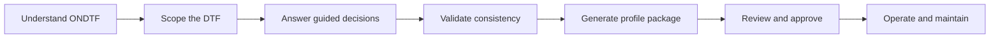

# Adoption

ONDTF adoption is a staged institutional and technical programme, not a single platform procurement. The adoption section provides guided pathways for understanding, constructing, validating, and maintaining a Digital Trust Framework derived from ONDTF.

## Guided framework construction

1. [Overview](guided-framework-construction.md)
2. [Construction stages](construction-stages.md)
3. [Decision states and review gates](decision-states-and-review-gates.md)
4. [Contradiction and completeness checks](contradiction-and-completeness.md)
5. [Generated artefacts](generated-artefacts.md)
6. [Workshop facilitation guide](workshop-guide.md)
7. [Model and implementation guide](guided-construction-model.md)
8. [Worked operational profile](../../examples/worked-profile/)

## Role-based adoption paths

- [Policy reader path](policy-reader-path.md)
- [Architect reader path](architect-reader-path.md)
- [Implementer reader path](implementer-reader-path.md)
- [Assurance reader path](assurance-reader-path.md)

The earlier construction-readiness page is retained as [model evolution context](guided-construction-readiness.md).
