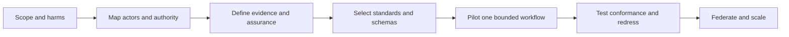

# Adoption

ONDTF adoption is a staged institutional and technical programme, not a single platform procurement.

```mermaid
flowchart LR
  S0[Scope and harms] --> S1[Map actors and authority]
  S1 --> S2[Define evidence and assurance]
  S2 --> S3[Select standards and schemas]
  S3 --> S4[Pilot one bounded workflow]
  S4 --> S5[Test conformance and redress]
  S5 --> S6[Federate and scale]
```
