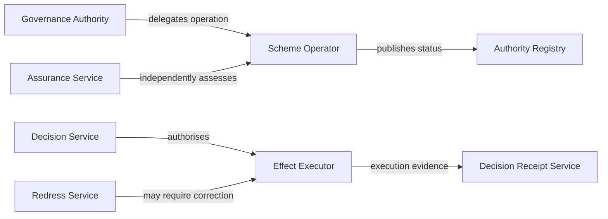

# Component catalogue

Components are logical responsibilities. They do not require one-to-one deployment as separate products. Combining components is permitted only where separation-of-duty, independent review and evidence-integrity requirements remain satisfied.

| ID | Logical component | Core responsibility | Principal inputs | Principal outputs |
|---|---|---|---|---|
| ARC-C01 | Governance Authority | Owns or exercises the mandate to establish and change a trust scheme. | governance record, policy mandate | approved policy, delegation, public notice |
| ARC-C02 | Trust Scheme Operator | Runs shared scheme processes under delegated authority. | approved rules, participant records | operational state, reports, incidents |
| ARC-C03 | Participant Registry | Publishes participant standing and role status. | admission decisions, status events | current registry record |
| ARC-C04 | Authority Registry | Publishes authority grants, limits and revocation state. | authority instruments | authority resolution data |
| ARC-C05 | Policy Registry | Publishes authoritative policy versions and effective dates. | approved policy | policy artefact and provenance |
| ARC-C06 | Evidence Provider | Produces claims or evidence under a defined authority. | source data, mandate | signed or otherwise protected evidence |
| ARC-C07 | Evidence Holder | Controls or presents evidence where the model supports possession. | evidence artefact | presentation or consent signal |
| ARC-C08 | Verifier | Validates evidence and status against a declared policy context. | presentation, registries, policy | verification result |
| ARC-C09 | Trust Resolution Service | Coordinates identity, authority, policy, status and assurance resolution. | interaction context | resolution result with reasons |
| ARC-C10 | Assurance Service | Evaluates whether controls and evidence satisfy required confidence. | control evidence, assessment scope | assurance assertion and limitations |
| ARC-C11 | Decision Service | Admits, denies, conditions or defers a proposed effect. | resolution and assurance results | trust decision |
| ARC-C12 | Effect Executor | Executes only an admitted effect and records execution state. | authorised decision | effect result |
| ARC-C13 | Decision Receipt Service | Creates tamper-evident decision records. | decision basis and outcome | decision receipt |
| ARC-C14 | Evidence Store | Preserves evidence with retention, access and integrity controls. | evidence package | retrievable evidence and provenance |
| ARC-C15 | Incident Management Service | Coordinates detection, containment, notification and recovery. | alerts and reports | incident record and actions |
| ARC-C16 | Challenge and Redress Service | Receives challenges, manages review and tracks remedy. | challenge and evidence | review decision and remedy status |
| ARC-C17 | Conformance Service | Publishes scoped declarations and assessment evidence. | test and assessment results | conformance declaration |
| ARC-C18 | Federation Gateway | Mediates recognition and evidence exchange across domains. | recognition agreement and mapping | bounded cross-domain result |

## Component specification template

Every profile that declares a component MUST specify:

1. accountable owner and operating owner;
2. mandate and decision rights;
3. authoritative inputs and outputs;
4. interfaces and trust boundaries;
5. security, privacy and availability obligations;
6. evidence created and retention period;
7. failure modes and containment behaviour;
8. applicable conformance tests.

## Separation constraints

The decision service and effect executor MAY be co-located for low-impact uses. High-impact profiles SHOULD require independent or separately controlled admission and execution functions. The assurance service MUST disclose conflicts of interest and MUST NOT imply independence where none exists.
