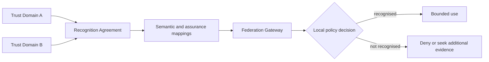

# Federation architecture

Federation allows independently governed trust domains to recognise selected authorities, evidence or decisions without surrendering local governance. ONDTF treats federation as a governed recognition relationship rather than a shared login arrangement.

## Recognition dimensions

A recognition decision MUST consider:

- semantic compatibility;
- authority and legal basis;
- assurance equivalence;
- lifecycle and status semantics;
- operational reliability;
- privacy and data-transfer constraints;
- incident cooperation;
- challenge and redress responsibility;
- withdrawal and transition arrangements.

## Recognition agreement minimum content

1. parties and accountable authorities;
2. recognised schemes, roles and artefact classes;
3. semantic and assurance mappings;
4. permitted purposes and excluded uses;
5. status and incident-notification arrangements;
6. audit and evidence access;
7. challenge and remedy coordination;
8. governing law or conflict mechanism where applicable;
9. suspension, withdrawal and transition;
10. review period and change process.

## No automatic equivalence

A foreign assurance level, credential label or certification MUST NOT be mapped solely by name. The receiving domain must evaluate underlying controls, evidence, freshness and governance. A recognition gateway may facilitate the evaluation, but the receiving accountable authority retains responsibility for the local decision.
