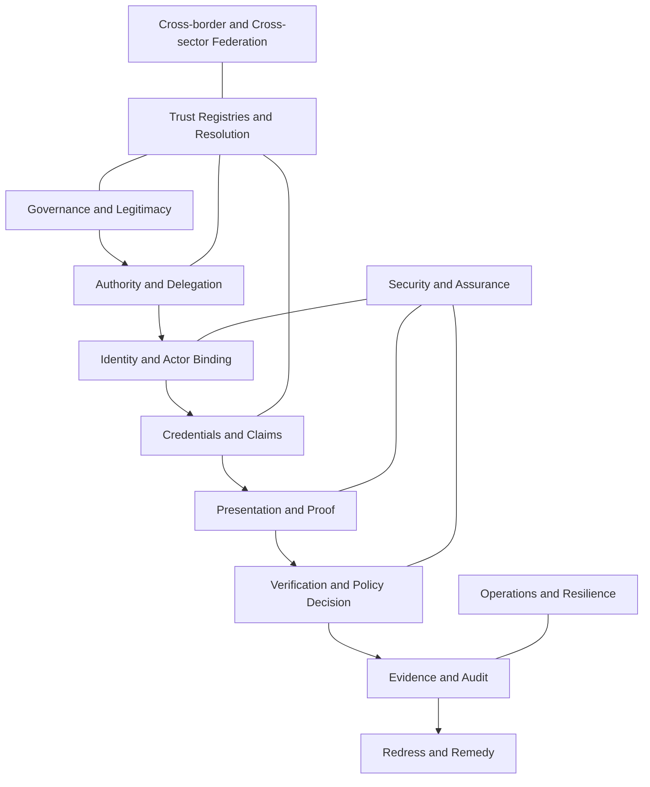

# National Digital Trust Architecture

The architecture separates concerns that are frequently collapsed into a single identity platform. Each layer has a distinct purpose, governance surface, threat model and assurance obligation.

## Architectural objectives

The architecture MUST support multiple sectors and governance authorities without requiring shared operational control. It MUST allow more than one credential format, identifier method, trust-registry implementation and wallet provider. It MUST nevertheless define common interoperability and conformance requirements.

## Layer model

| Layer | Purpose | Primary question |
|---|---|---|
| Governance | Establish legitimacy and decision rights | Who sets the rules? |
| Authority | Express mandates and delegation | Who may do what, for whom and within what limits? |
| Identity | Bind actors to identifiers and authenticators | Which actor is participating? |
| Credential | Carry signed claims and attestations | What has an authorised issuer asserted? |
| Proof | Minimise and bind disclosures | What must be demonstrated now? |
| Verification | Evaluate evidence against policy | Is the requested action acceptable? |
| Registry | Resolve authoritative standing | Which governance and issuer records apply? |
| Assurance | Establish confidence and residual risk | How much reliance is justified? |
| Evidence | Preserve accountable transaction records | What happened and why? |
| Redress | Correct outcomes and allocate responsibility | How can an affected party challenge harm? |

## Deployment topology

The architecture supports centralised, federated, distributed and hybrid deployments. No component is required to use a blockchain or distributed ledger. Trust anchors may be expressed through PKI, controlled identifiers, trust lists, registries, DIDs or equivalent mechanisms, provided the applicable profile defines resolution and governance semantics.
