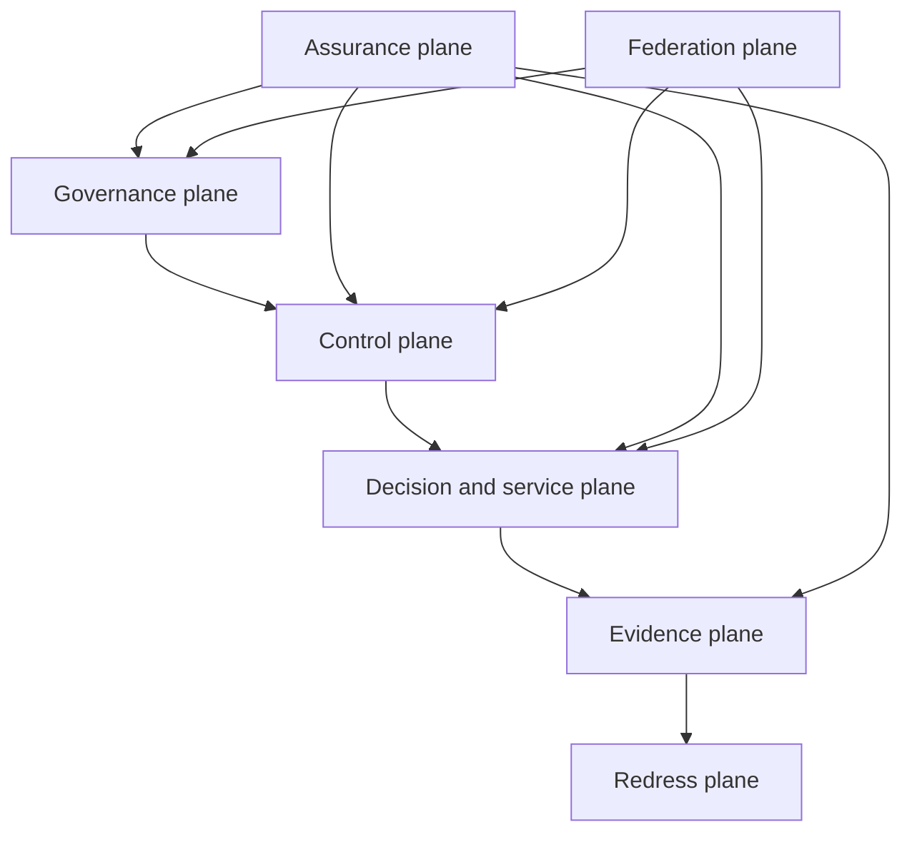

# ONDTF Reference Architecture

The ONDTF reference architecture translates the core capabilities and target operating model into a deployment-neutral system of responsibilities, services, information exchanges, controls and evidence obligations. It specifies **what must be separated, resolved, evaluated, recorded and governed** without prescribing a particular product, protocol, ledger, credential format or organisational topology.

The architecture is designed for jurisdictions that need to coordinate public authorities, sector regulators, private operators, trust-service providers, communities and affected parties while preserving constitutional, legal and institutional differences.

## Architecture publication set

- [Architecture principles](principles.md)
- [Layered reference architecture](layered-reference-architecture.md)
- [Architecture viewpoints](viewpoints.md)
- [Component catalogue](component-catalogue.md)
- [Service catalogue](service-catalogue.md)
- [Interaction catalogue](interaction-catalogue.md)
- [Trust boundaries](trust-boundaries.md)
- [Federation architecture](federation.md)
- [Failure containment and resilience](resilience.md)
- [Deployment neutrality](deployment-neutrality.md)

## Normative posture

The architecture uses normative language where a separation, capability, evidence obligation or control is necessary for ONDTF conformance. Component names are logical responsibilities rather than mandatory deployable products. A single system may perform several compatible responsibilities, but an adopter MUST demonstrate that required separation of duties, independent review, evidence integrity and conflict-of-interest controls remain effective.
