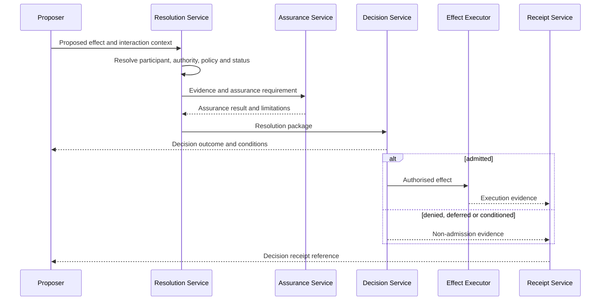

# Interaction catalogue

The catalogue identifies the minimum interactions needed to establish, operate and review a national digital trust environment. Detailed workflows are published in the [workflow specification](../workflows/index.md).

| ID | Interaction | Primary evidence |
|---|---|---|
| INT-01 | Establish a trust scheme | mandate, governance record, approved policy |
| INT-02 | Admit a participant | application, assessment, admission decision |
| INT-03 | Recognise an evidence provider | authority and assurance record |
| INT-04 | Grant authority | authority instrument and acceptance |
| INT-05 | Delegate authority | delegation chain and constraints |
| INT-06 | Issue evidence or credential | issuance record and source provenance |
| INT-07 | Present or obtain evidence | presentation context and consent basis |
| INT-08 | Resolve trust | resolution result and source provenance |
| INT-09 | Admit an effect | trust decision and decision receipt |
| INT-10 | Change status or revoke | authorised status event |
| INT-11 | Suspend a participant | suspension decision and notice |
| INT-12 | Change policy | approved change record and effective date |
| INT-13 | Invoke emergency authority | emergency decision and review obligation |
| INT-14 | Report and contain an incident | incident record and containment evidence |
| INT-15 | Submit and decide a challenge | challenge record, review decision |
| INT-16 | Execute a remedy | remedy authority and completion evidence |
| INT-17 | Establish cross-domain recognition | recognition agreement and equivalence map |
| INT-18 | Withdraw recognition | withdrawal notice and transition plan |
| INT-19 | Declare conformance | scoped declaration and assessment evidence |
| INT-20 | Retire a trust scheme | retirement decision and continuity record |

