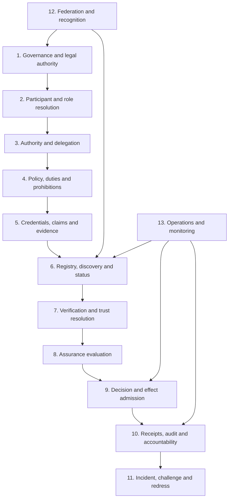

# Layered reference architecture

The layered model prevents identity, credential verification and registry lookup from being mistaken for the complete trust decision. Each layer contributes a distinct form of evidence or control.

## Layer responsibilities

| Layer | Responsibility | Required output |
|---|---|---|
| Governance and legal authority | Establish mandate, legitimacy and decision rights | Authoritative governance record |
| Participant and role resolution | Identify the actor and relevant role | Resolved participant and role context |
| Authority and delegation | Determine whether the action is authorised | Authority resolution result |
| Policy | Determine applicable permissions, duties and prohibitions | Versioned policy decision basis |
| Credentials, claims and evidence | Provide assertions and supporting material | Validated evidence set |
| Registry, discovery and status | Identify authoritative sources and current standing | Current status and provenance |
| Verification and trust resolution | Evaluate evidence against policy and context | Verification result with reasons |
| Assurance evaluation | Determine confidence and residual uncertainty | Assurance result and limitations |
| Decision and effect admission | Admit, deny, defer or condition an effect | Trust decision |
| Receipts and audit | Preserve attribution and explanation | Decision receipt and audit evidence |
| Incident and redress | Detect failure and provide correction or remedy | Incident and redress record |
| Federation | Govern recognition across domains | Recognition decision and mapping |
| Operations | Sustain availability, integrity and recovery | Operational evidence and service state |

## Plane model

The layers are exercised through six cross-cutting planes:

- **governance plane**, which creates and changes mandates, policies and institutional arrangements;
- **control plane**, which publishes authoritative configuration, registries and status;
- **decision plane**, which evaluates a proposed action in context;
- **evidence plane**, which preserves provenance, receipts and audit material;
- **assurance plane**, which evaluates controls, assessors and confidence;
- **redress plane**, which enables challenge, correction, remedy and systemic learning.

No profile should collapse these planes without documenting the resulting conflicts of interest and compensating controls.
