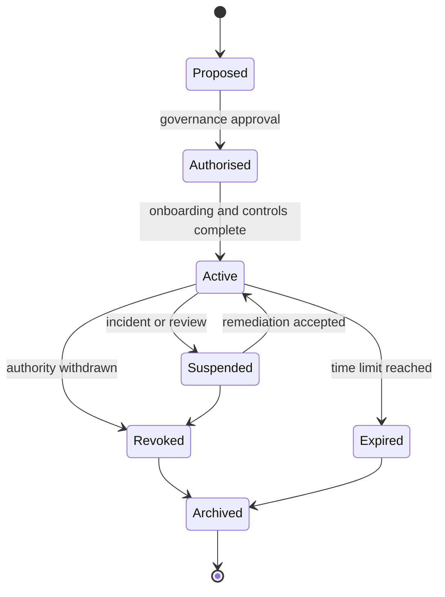

# Trust Lifecycle

The lifecycle applies to participants, credentials, delegated authorities, registry entries, policy versions and certification states.

Every lifecycle transition MUST identify the initiating authority, effective time, reason, evidence and notification obligations. High-impact transitions SHOULD support independent review and appeal.
