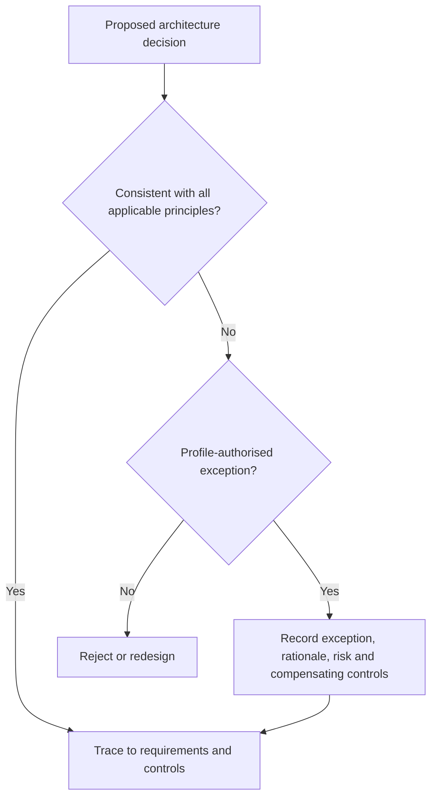

# Architecture principles

The principles below govern design decisions, profile development and conformance interpretation. Each principle states the rule, its rationale and the implications for adopters.

## AP-01 — Legitimacy precedes technical trust

**Statement.** A cryptographically valid artefact SHALL NOT be treated as sufficient evidence that an actor possessed legitimate authority or that a proposed effect was permissible.

**Rationale.** Authentication proves control of an authenticator. It does not establish mandate, purpose, jurisdiction, duty, proportionality or the rights of affected parties.

**Implications.** Implementations must resolve authority and applicable policy separately from identity authentication. Decision records must distinguish cryptographic validity from governance validity.

## AP-02 — Authority is explicit, bounded and reviewable

Authority MUST identify its source, scope, subject, permitted actions, constraints, validity period and termination conditions. Delegation MUST attenuate rather than silently expand authority.

## AP-03 — Evidence before effect

A high-impact effect SHOULD be admitted only after the evidence required by the applicable policy has been evaluated. Where emergency execution is permitted, post-action evidence and independent review MUST be mandatory.

## AP-04 — Governance, operation and assurance are separable

The same organisation MAY perform more than one role, but incompatible decision rights MUST be separated through organisational, procedural or technical controls. Self-asserted assurance SHALL NOT substitute for independent evidence where the profile requires independence.

## AP-05 — Trust boundaries are declared

Every cross-domain interaction MUST identify the originating domain, receiving domain, authoritative sources, assurance assumptions and responsibility for failures. Hidden transitive trust is prohibited.

## AP-06 — Policy is traceable to authority

A policy used to admit or deny an effect MUST be traceable to an authorised policy owner, a version, an effective period and a change record.

## AP-07 — Data minimisation is architectural

The architecture SHOULD support selective disclosure, derived claims, purpose-specific identifiers and bounded retention. Privacy shall not depend solely on policy promises made after collection.

## AP-08 — Accountability survives automation

Automated decisions and agent-mediated actions MUST remain attributable to accountable authorities and operators. Automation SHALL NOT create an accountability vacuum.

## AP-09 — Redress is a first-class capability

A party affected by a trust decision MUST have a discoverable route to correction, challenge or remedy appropriate to the impact. The evidence needed for review MUST be retained for the applicable period.

## AP-10 — Federation does not imply equivalence

Recognition of another domain MUST be based on an explicit mapping of semantics, governance, assurance, status and redress. Technical interoperability alone SHALL NOT create legal or assurance equivalence.

## AP-11 — Profiles specialise; the core remains neutral

Jurisdiction, sector and technical profiles MAY constrain or extend the architecture. Such profiles MUST declare all deviations and SHALL NOT redefine core terms incompatibly.

## AP-12 — Conformance is observable

A conformance claim MUST identify the profile, version, capability scope, evidence set and assessment basis. Brand, product or repository adoption alone is not proof of conformance.

## Decision test

