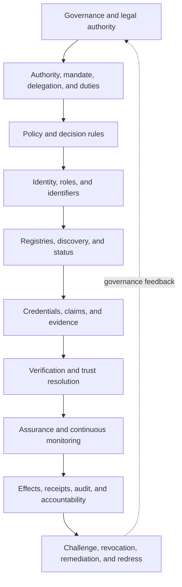

# Reference Trust Stack

```mermaid
flowchart TB
  G[Governance and legal authority]
  A[Authority, mandate, delegation, and duties]
  P[Policy and decision rules]
  I[Identity, roles, and identifiers]
  R[Registries, discovery, and status]
  C[Credentials, claims, and evidence]
  V[Verification and trust resolution]
  S[Assurance and continuous monitoring]
  E[Effects, receipts, audit, and accountability]
  D[Challenge, revocation, remediation, and redress]
  G --> A --> P --> I --> R --> C --> V --> S --> E --> D
  D -. governance feedback .-> G
```

The stack is logical, not a mandatory deployment topology. A service may implement several layers, but profiles must preserve separation of responsibility and evidence.
