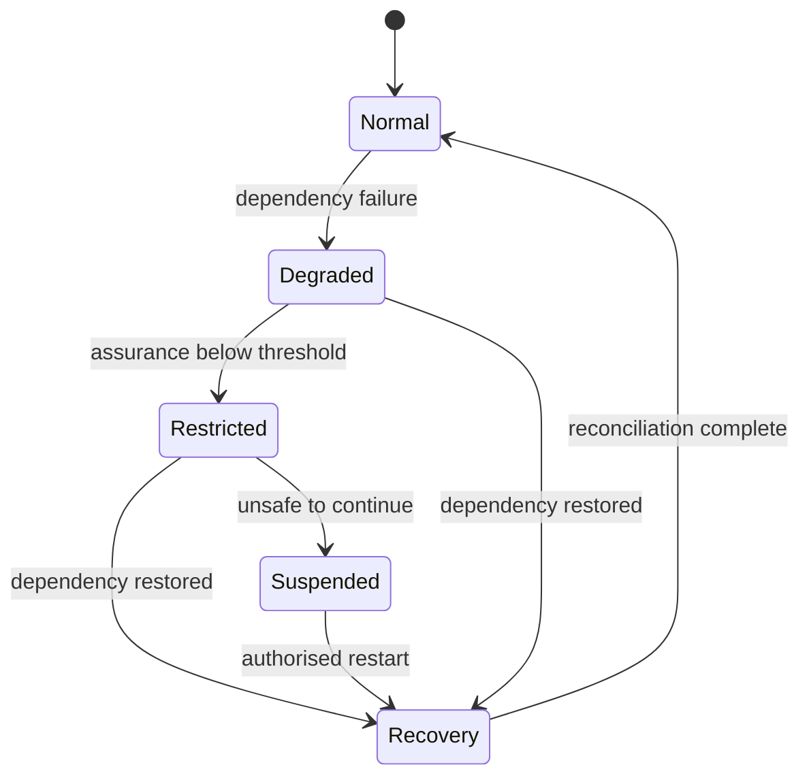

# Failure containment and resilience

Trust infrastructure must remain safe under partial failure. Availability is important, but unsafe fallback can be more damaging than temporary non-availability.

## Failure classes

- unavailable authoritative source;
- stale or contradictory status;
- compromised evidence provider;
- invalid or ambiguous authority chain;
- policy-version mismatch;
- degraded assurance evidence;
- decision-service failure;
- receipt or evidence-store failure;
- cross-domain recognition outage;
- incident-management overload.

## Safe-failure principles

1. A failure to obtain required evidence MUST NOT be interpreted as successful verification.
2. Cached data MAY be used only within a profile-defined freshness period and with the cache age disclosed.
3. High-impact actions SHOULD fail closed or defer to authorised human review.
4. Emergency operation MUST be time-bounded, separately authorised and retrospectively reviewed.
5. Recovery MUST reconcile decisions, status events and receipts created during degradation.

## Continuity evidence

An operator SHOULD retain outage timelines, affected capabilities, fallback decisions, stale-data use, emergency approvals, reconciliation results and notifications. Profiles may define recovery-point and recovery-time objectives according to impact.
