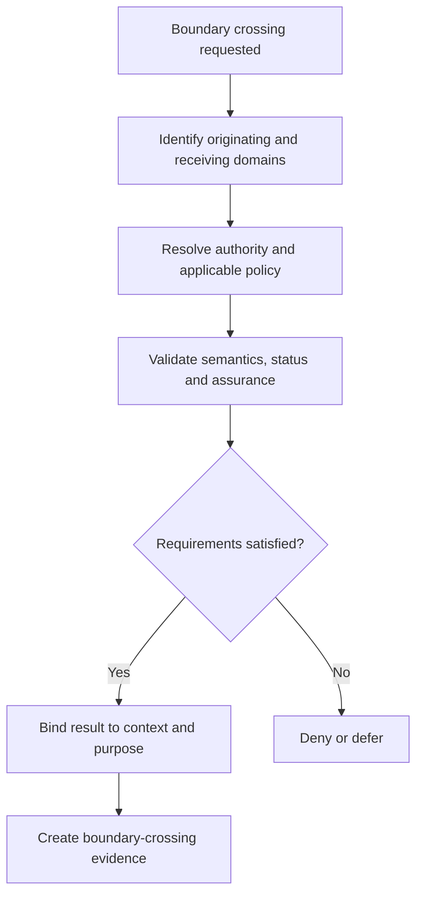

# Trust-boundary model

A trust boundary is a point at which authority, evidence, semantics, control or accountability changes. Crossing a boundary requires explicit validation; confidence must not be inherited merely because systems are connected.

## Boundary catalogue

| ID | Boundary | Principal risk | Required treatment |
|---|---|---|---|
| TB-01 | Government mandate to scheme operator | authority overreach | explicit delegation and oversight |
| TB-02 | Regulator to regulated participant | conflict and ambiguity | published rules and appeal route |
| TB-03 | Scheme to participant | stale standing | current status resolution |
| TB-04 | Evidence provider to verifier | false or mis-scoped claim | provenance, authority and status validation |
| TB-05 | Principal to delegate | delegation laundering | attenuation and chain validation |
| TB-06 | Decision service to effect executor | unauthorised execution | bound decision reference and replay controls |
| TB-07 | Domestic to foreign domain | false equivalence | recognition mapping and jurisdiction checks |
| TB-08 | Automated agent to affected party | unreviewable harm | mandate, limits, receipt and redress |
| TB-09 | Evidence producer to evidence store | tampering or loss | integrity, provenance and retention controls |
| TB-10 | Operator to assurance provider | self-certification | independence disclosure and evidence separation |

## Boundary-crossing rule

Every boundary crossing MUST identify source provenance, evaluation time, applicable profile and responsibility for error correction. Assurance inherited from another domain MUST be constrained to the scope assessed in that domain.

The developing v0.5.0 security baseline provides a more granular [security boundary model](../security/security-boundaries.md), including boundary states, crossing evidence, failure modes, and stable security-boundary identifiers.
