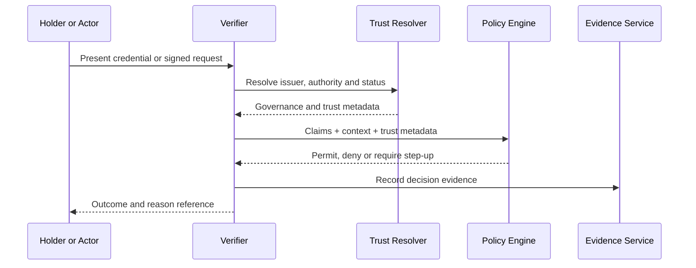

# Trust Model

## Trust statement

A trust decision is a context-specific determination that an actor, claim, credential, service or action may be relied upon for a defined purpose, subject to stated conditions and residual risk.

A conformant trust statement SHOULD identify:

- subject of trust;
- relying party or class of relying parties;
- purpose and permitted use;
- governing framework;
- source of authority;
- assurance level;
- evidence evaluated;
- time and validity conditions;
- applicable jurisdiction;
- revocation or suspension state;
- decision outcome and reason code.

## Trust is not transitive by default

If A trusts B and B trusts C, A does not automatically trust C. Transitive trust requires an explicit federation rule, delegation chain or cross-recognition agreement.

## Trust decision pipeline

