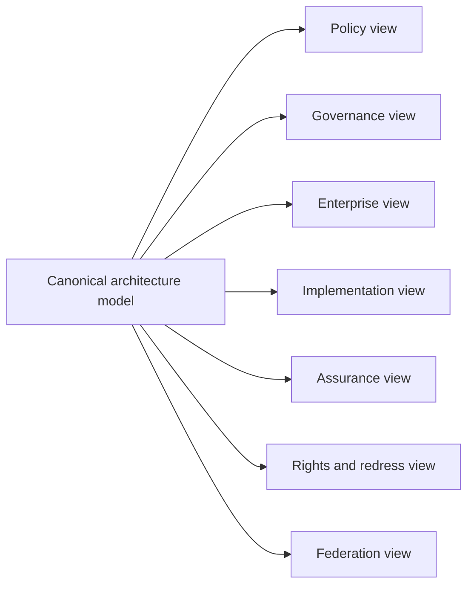

# Architecture viewpoints

A national digital trust framework is read by institutions with different responsibilities. ONDTF therefore defines multiple consistent views of the same architecture.

| Viewpoint | Primary concern | Key artefacts |
|---|---|---|
| Policymaker | Public outcomes, legitimacy and rights | Principles, institutional functions, redress model |
| Governance authority | Decision rights, delegation and oversight | Authority model, policy lifecycle, transparency records |
| Enterprise architect | Boundaries, services and integration | Components, services, information exchanges |
| Implementer | Interfaces, states and failure handling | Workflow specifications, entity model, profiles |
| Assurance provider | Controls, evidence and independence | Assurance assertions, control mapping, receipts |
| Affected party | Explanation, correction and remedy | Decision notice, challenge route, remedy status |
| Federation partner | Recognition and equivalence | Recognition agreement, mappings, withdrawal process |

## View consistency rule

A view MAY omit details irrelevant to its audience, but it MUST NOT contradict another view. Every view must trace to the same capability, requirement, component and information identifiers.

## Required questions by viewpoint

### Policymaker

- Which public interest objective is being served?
- Which institution is accountable?
- What rights and remedies exist?
- Which risks are accepted, transferred or prohibited?

### Architect and implementer

- Which authoritative sources are consulted?
- Where are trust boundaries crossed?
- Which evidence is created and retained?
- How does the system fail safely?

### Assurance provider

- Which controls support each claim?
- How fresh and independent is the evidence?
- Which inherited assurances are invalid across the boundary?

### Affected party

- What decision was made?
- Which policy and evidence were material?
- How can incorrect data or authority be challenged?
- Who is responsible for executing a remedy?
