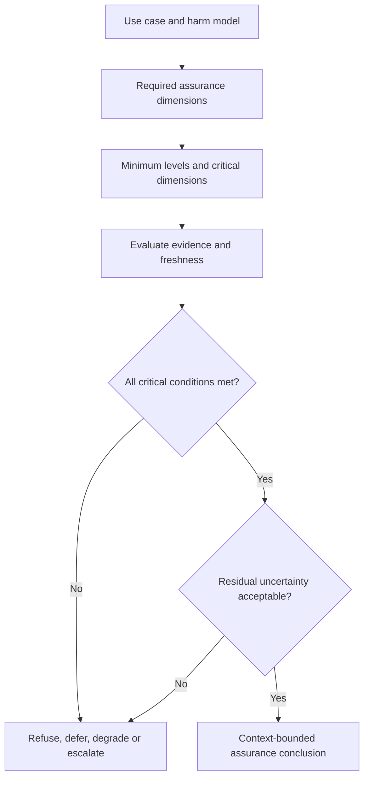

# Assurance composition

Assurance composition determines how dimension-level conclusions support a particular use case. The profile defines required dimensions, minimum levels, critical dimensions, dependency rules, freshness and the action to take when evidence is incomplete.

## Composition rules

A composition rule must identify critical dimensions whose failure cannot be offset, permissible dependencies, evidence precedence, uncertainty treatment and exception authority. The rule should use a weakest-critical-link approach rather than averaging levels.

The machine-readable representation is defined in `model/assurance/assurance-levels.yaml` and `model/assurance/assurance-claim.schema.json`.
