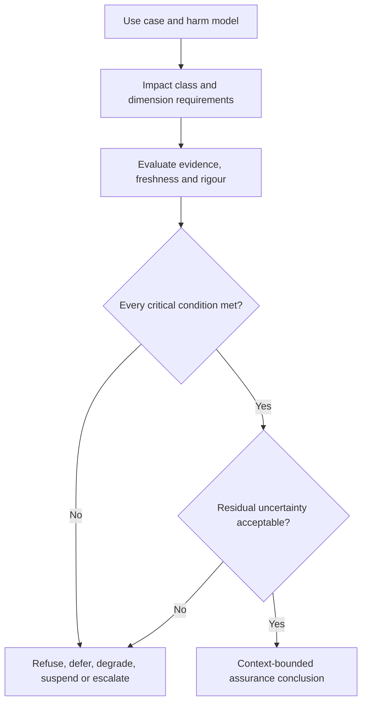

# Assurance composition

Assurance composition applies a critical-dimension floor. The profile identifies required dimensions, minimum requirements, criticality, freshness, failure actions and exception authority.

A dimension marked critical blocks a supported conclusion when its achieved result is below requirement, stale, indeterminate or unsupported. Arithmetic averaging and compensation across dimensions are prohibited.

```mermaid
flowchart TD
  U[Use case and harm model] --> R[Impact class and dimension requirements]
  R --> V[Evaluate evidence, freshness and rigour]
  V --> C{Every critical condition met?}
  C -->|No| X[Refuse, defer, degrade, suspend or escalate]
  C -->|Yes| Q{Residual uncertainty acceptable?}
  Q -->|No| X
  Q -->|Yes| A[Context-bounded assurance conclusion]
```
