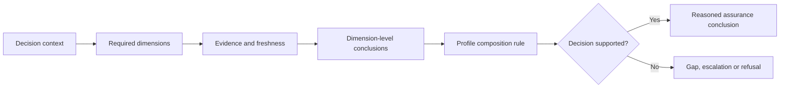

# Multidimensional assurance model

ONDTF represents assurance as a set of independently evidenced dimensions rather than a single trust score. A decision may require strong identity evidence and still fail because authority is absent, delegation is stale, execution exceeded scope, or remedy is unavailable.

## Assurance dimensions

The canonical dimensions are defined in `model/assurance/assurance-dimensions.yaml`:

| Dimension | Core question |
|---|---|
| Identity | Is the relevant subject established to the required degree? |
| Authority | Does the actor possess valid authority for this action and context? |
| Delegation | Is delegated authority valid, scoped, current and traceable? |
| Evidence | Is the evidence authentic, relevant, sufficient and current? |
| Execution | Did the action remain within mandate, policy and technical constraints? |
| Operational | Can the service operate securely, reliably and recoverably? |
| Status and freshness | Are lifecycle status and time-sensitive facts sufficiently current? |
| Privacy | Are data use and disclosure proportionate and controlled? |
| Remedy readiness | Can affected parties obtain explanation, challenge, review and effective remedy? |

## No compensating trust score

A profile may define composition rules, minimum levels and permitted dependencies. It MUST NOT collapse dimensions into a universal score that allows strength in one dimension to conceal a critical failure in another. In particular, identity assurance cannot substitute for authority, and operational availability cannot substitute for lawful or legitimate exercise of power.

## Assurance conclusion

An assurance conclusion records the decision context, selected dimensions, evidence, level reached, freshness, residual uncertainty, exceptions and the profile rule used. It is bounded to that context and must not be reused as a general declaration that an entity is trustworthy.
