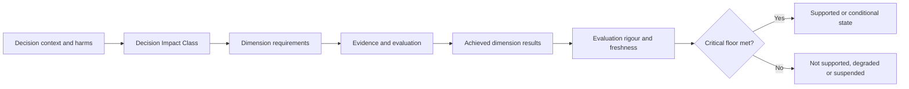

# Multidimensional assurance model

ONDTF represents assurance as a context-bounded vector. It records decision impact, dimension requirements, achieved results, evaluation rigour, freshness, current state and blocking gaps. It never produces a universal trust score.

```mermaid
flowchart LR
  C[Decision context and harms] --> I[Decision Impact Class]
  I --> R[Dimension requirements]
  R --> E[Evidence and evaluation]
  E --> A[Achieved dimension results]
  A --> G[Evaluation rigour and freshness]
  G --> P{Critical floor met?}
  P -->|Yes| S[Supported or conditional state]
  P -->|No| N[Not supported, degraded or suspended]
```

The canonical dimensions remain identity, authority, delegation, evidence, execution, operational, status and freshness, privacy, and remedy readiness. Identity assurance cannot substitute for authority; authentication strength cannot cure invalid delegation; operational resilience cannot cure unlawful execution; and auditability cannot cure absence of remedy.

The machine-readable profile, conclusion and evidence schemas separate requirements from results and assessment confidence.
