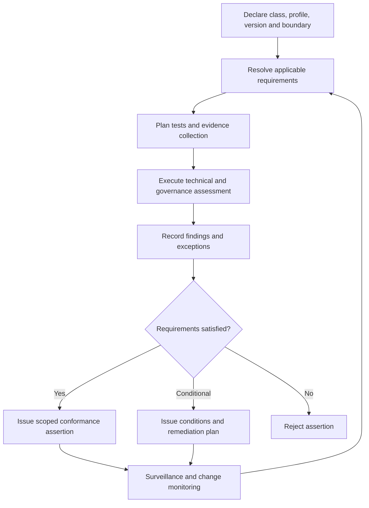

# Conformance and assessment

ONDTF conformance is profile-based, scope-bounded and evidence-backed. Assessment determines whether a declared conformance class meets applicable requirements. Assurance determines how much confidence may reasonably be placed in that result.

## Assessment methods

- self-assessment;
- second-party assessment by a relying ecosystem or scheme authority;
- independent third-party assessment;
- automated conformance testing;
- continuous evidence evaluation;
- combined assessment using several methods.

## Assessment workflow

## Independence and competence

An assessment statement MUST disclose assessor competence, conflicts of interest, funding relationship, methods used and evidence limitations. Independent assessment is required only where the applicable profile or risk level requires it.

## Conformance assertion

The machine-readable minimum is defined in `model/assurance/conformance-assertion-schema.yaml`.
