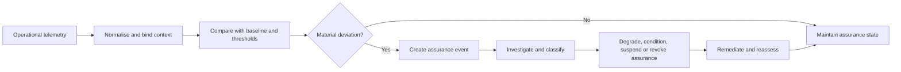

# Continuous assurance and trust observability

Continuous assurance maintains confidence between formal assessment points. It observes whether assumptions, dependencies, controls and service outcomes remain within approved bounds.

## Observable domains

- authority and delegation status;
- credential and registry status freshness;
- control operation and configuration drift;
- policy and software change;
- service availability, latency and error rates;
- security events and incident indicators;
- complaint, challenge and remedy outcomes;
- dependency concentration and supplier state;
- assurance evidence expiry;
- jurisdiction or recognition changes.

## Assurance events

An assurance event SHOULD be created when there is a material control failure, incident, scope change, ownership change, critical vulnerability, expired evidence, adverse legal change, or sustained breach of an operational threshold.

Automated monitoring MAY change an assurance state, but high-impact suspension or reinstatement SHOULD remain subject to governed authority and recorded reasons.
