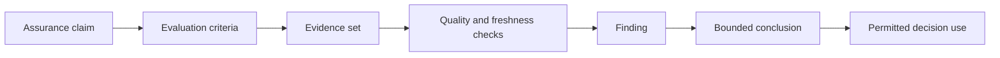

# Assurance evidence model

Assurance evidence supports a bounded conclusion. Evidence MUST be attributable, relevant to the claim, current enough for its use, protected from unauthorised change, and reproducible or independently inspectable where feasible.

## Evidence classes

| Class | Examples | Principal limitation |
|---|---|---|
| Governance | mandates, policies, appointments, decisions | may not reflect actual operation |
| Design | architecture, threat models, control specifications | may not reflect deployed configuration |
| Implementation | configuration, code, test output, deployment attestations | may become stale after change |
| Operational | logs, metrics, incidents, status histories | may be incomplete or selectively retained |
| Independent | audit, assessment, certification, external test | scope and competence may be misunderstood |
| Outcome | complaints, harms, recovery performance, false decisions | lagging signal and attribution difficulty |

## Evidence quality properties

Every assurance package SHOULD record:

- claim and evaluation criterion;
- evidence identifier, producer and custodian;
- collection method and timestamp;
- validity or freshness period;
- integrity and provenance mechanism;
- scope and excluded components;
- known limitations and uncertainty;
- access restrictions and retention rule;
- relationship to controls, risks and decisions.

Evidence MUST NOT be reused outside its assessed scope without a new applicability determination.
