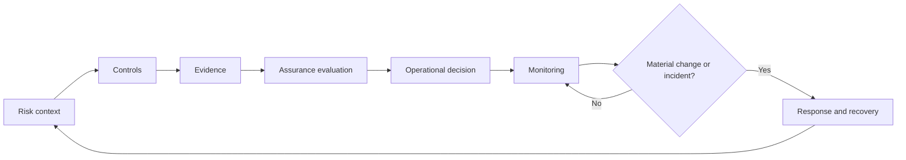

# Operational assurance, risk and resilience

ONDTF assurance is the governed process by which claims about authority, controls, services and outcomes are supported by evidence, evaluated against explicit criteria, and kept current during operation. It is not a one-time certification and it is not a universal trust score.

## Publication set

- [Risk Management Method](risk-management.md)
- [Assurance Evidence Model](evidence-model.md)
- [Assurance Evaluation and Conclusions](evaluation.md)
- [Conformance and Assessment](conformance-assessment.md)
- [Continuous Assurance and Trust Observability](continuous-assurance.md)
- [Operational Resilience](operational-resilience.md)
- [Exceptions, Waivers and Risk Acceptance](exceptions-waivers.md)
- [Metrics and Reporting](metrics-reporting.md)
- [Assurance Levels](levels.md)

The companion [Standards and Specifications Register](../standards/references.md) identifies the external sources used to ground the method.

## Multidimensional assurance publications

- [Multidimensional Assurance Model](assurance-level-model.md)
- [Identity Assurance](identity-assurance.md)
- [Authority Assurance](authority-assurance.md)
- [Delegation Assurance](delegation-assurance.md)
- [Evidence Assurance](evidence-assurance.md)
- [Execution Assurance](execution-assurance.md)
- [Status and Freshness Assurance](status-freshness-assurance.md)
- [Privacy Assurance](privacy-assurance.md)
- [Remedy Readiness Assurance](remedy-readiness-assurance.md)
- [Assurance Composition](assurance-composition.md)
