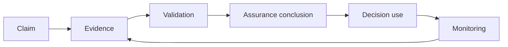

# Assurance Framework

Assurance is the disciplined basis for relying on identity, authority, evidence, controls, services, and governance outcomes.

The framework distinguishes identity assurance, authority assurance, evidence assurance, service assurance, governance assurance, and operational assurance.
