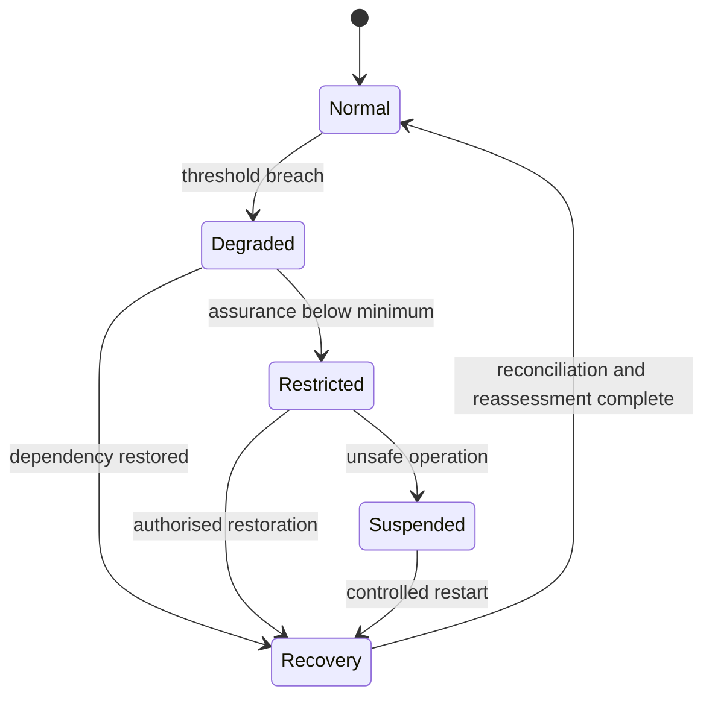

# Operational resilience

Operational resilience is the ability to continue or safely suspend critical trust services, contain failure, recover authoritative state and demonstrate what occurred. Availability alone is insufficient if degraded operation creates illegitimate effects.

## Resilience capabilities

1. critical-service and dependency mapping;
2. recovery-time and recovery-point objectives;
3. safe degradation and fail-closed rules;
4. tested backup, restoration and authoritative-state reconciliation;
5. incident command and cross-domain coordination;
6. emergency authority with expiry and review;
7. communications to operators, relying parties and affected parties;
8. post-incident assurance reassessment;
9. exercises covering technical, governance and supplier failure;
10. evidence retention for investigation and remedy.

A recovery declaration MUST identify unresolved data gaps, stale decisions, affected transactions, compensating measures and any residual risk accepted for return to service.
