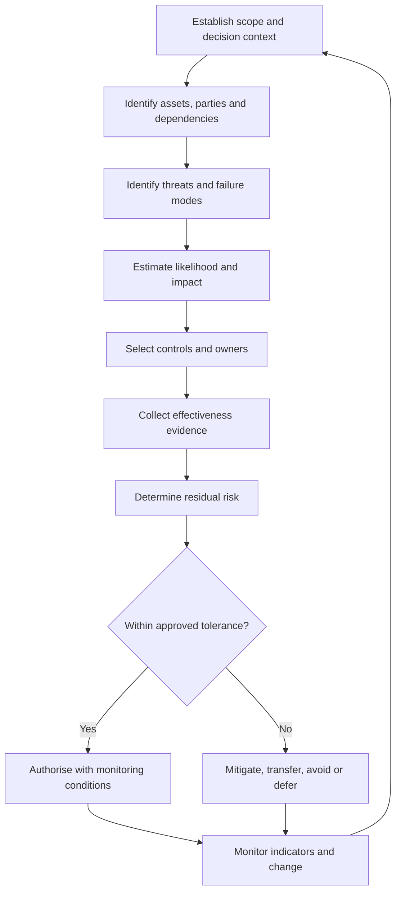

# Risk management method

ONDTF adopters MUST operate a repeatable risk process that connects protected assets, threat events, affected parties, controls, residual exposure and accountable acceptance decisions. The method is compatible with [ISO 31000](../standards/references.md#ref-ISO-31000-2018), [ISO/IEC 27005](../standards/references.md#ref-ISO-IEC-27005-2022) and [NIST risk-management concepts](../standards/references.md#ref-NIST-SP-800-37-R2), but ONDTF does not claim conformance to those standards merely by using this method.

## Risk statement

Each risk MUST be expressed as:

> Because of a stated source or condition, a defined threat event may affect a protected asset or party through an identified boundary or attack surface, causing specified consequences.

## Assessment dimensions

| Dimension | Scale | Required basis |
|---|---:|---|
| Likelihood | 1-5 | capability, intent, exposure, precedent and control state |
| Impact | 1-5 | legal, human, operational, financial, societal and systemic consequence |
| Control effectiveness | 0-4 | absent, weak, partial, effective or independently evidenced |
| Uncertainty | low, medium, high | evidence freshness, completeness and model uncertainty |

An adopter MAY use a different numerical model, but MUST publish the mapping and preserve the distinction between inherent and residual risk.

## Risk lifecycle

## Risk acceptance

Residual risk MUST be accepted by an authority with an explicit mandate, within a defined scope and time period. Acceptance records MUST identify assumptions, compensating controls, review triggers, affected parties, and any conditions attached to continued operation.

## Machine-readable record

The canonical schema is represented by `model/assurance/risk-register-schema.yaml`. Implementations MAY extend it without removing required fields.
