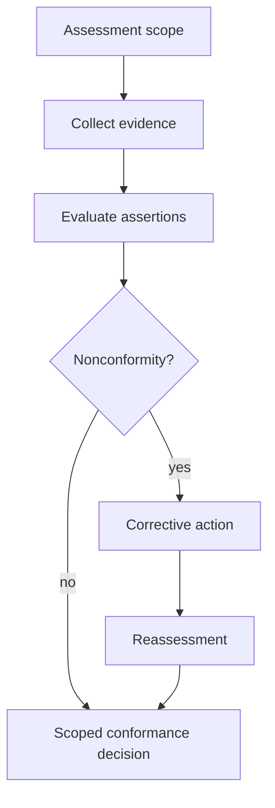
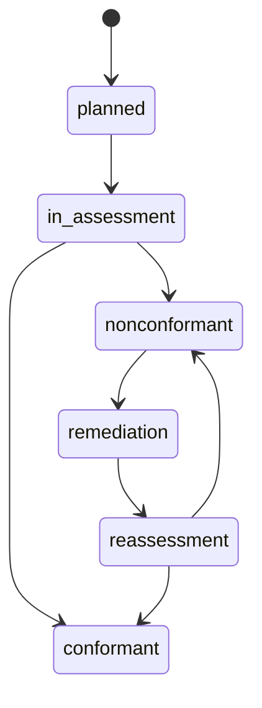
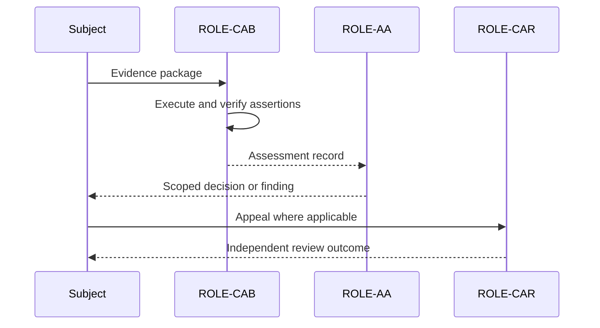

# Assessment decision

An assessment finding and a conformance decision are distinct. The assessment team evaluates evidence; the authorised decision function determines whether the claim may be issued, restricted, deferred or refused.

A decision MUST identify the assessed object, applicable profile and requirements, findings, unresolved exceptions, scope, conditions, validity, surveillance plan, reasons and appeal route. The decision maker MUST have access to sufficient evidence and MUST record conflicts and recusals.

## Assessment decision views

### Flow view

### State view

### Swimlane view

