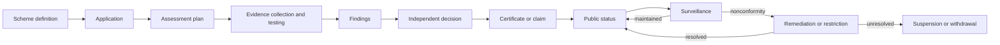

# Conformance and accreditation

ONDTF separates repository validation, artefact conformance, implementation conformance and operational conformance. A conformance claim is valid only for its declared object, scope, profile, assessment method and validity period.

## Conformance lifecycle

## Core pages

- [Conformance Claim Types](conformance-claim-types.md)
- [Assessment Scheme](assessment-scheme.md)
- [Assessor Competence and Independence](assessor-competence.md)
- [Evidence Requirements](evidence-requirements.md)
- [Assessment Decision](assessment-decision.md)
- [Certificate and Claim Lifecycle](certificate-and-claim-lifecycle.md)
- [Surveillance and Reassessment](surveillance-and-reassessment.md)
- [Nonconformity and Remediation](nonconformity-and-remediation.md)
- [Public Conformance Register](public-conformance-register.md)
- [Appeals and Complaints](appeals-and-complaints.md)
