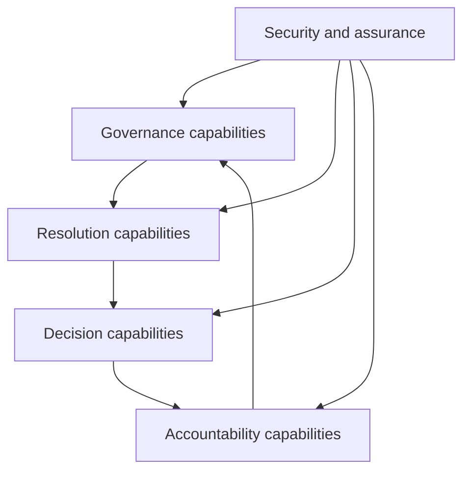

# Capability model

ONDTF expresses the core primarily as capabilities and observable outcomes. Implementations may realise these capabilities through centralised, federated, decentralised, or hybrid arrangements.

| ID | Capability | Required outcome |
|---|---|---|
| CAP-01 | Governance establishment | Identify the mandate, accountable authority, decision rights, and oversight arrangements |
| CAP-02 | Participant governance | Admit, classify, monitor, suspend, and remove participants under published rules |
| CAP-03 | Identity and role resolution | Resolve an actor and relevant role to the assurance required by the interaction |
| CAP-04 | Authority resolution | Determine whether authority exists, is current, and is valid for the proposed action |
| CAP-05 | Delegation control | Establish, attenuate, trace, suspend, and terminate delegated authority |
| CAP-06 | Policy evaluation | Identify and evaluate applicable permissions, duties, prohibitions, and conditions |
| CAP-07 | Evidence management | Collect, validate, preserve, disclose, and retire evidence proportionately |
| CAP-08 | Registry and status resolution | Discover authoritative sources and obtain current status information |
| CAP-09 | Assurance evaluation | Determine whether evidence, controls, assessors, and freshness satisfy the required confidence |
| CAP-10 | Effect admission | Decide whether a proposed effect may enter a governed process |
| CAP-11 | Decision accountability | Produce sufficient records to explain, attribute, review, and contest a decision |
| CAP-12 | Incident response | Detect, contain, investigate, notify, recover, and preserve evidence |
| CAP-13 | Challenge and redress | Provide accessible routes for correction, appeal, remedy, and escalation |
| CAP-14 | Interoperability | Support semantic, governance, assurance, operational, and technical compatibility |
| CAP-15 | Conformance evidence | Declare scope and produce evidence for a named profile, class, and version |

## Capability composition

