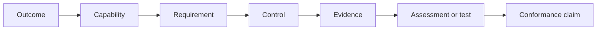

# Requirements traceability

Traceability prevents normative statements from becoming disconnected from public-interest outcomes, risks, operational ownership, and evidence.

Each normative requirement SHOULD be traceable to:

- at least one intended outcome;
- one or more capabilities;
- accountable and operating roles;
- relevant threats or failure modes;
- controls and evidence expectations;
- an assessment method;
- any profile-specific strengthening.

The initial machine-readable register contains identifiers, categories, normative force, capability mappings, and evidence expectations. Later releases will extend it with control and test references.
