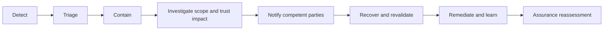

# Data breach response

A breach response SHALL consider confidentiality loss, integrity compromise, availability disruption, unauthorised correlation, provenance failure, and manipulation of trust decisions.

Response records SHOULD identify affected data and people, compromised authority or decisions, status changes required, containment, notifications, recovery evidence, residual risk, and remedies. Where corrupted data may have produced decisions, response includes identifying and reviewing downstream effects.
