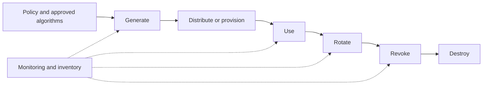

# Cryptographic protection and key management

Cryptography protects confidentiality, integrity, authenticity, and non-repudiation only when algorithms, keys, identities, policy, and operations remain governed together.

Implementations SHOULD maintain a cryptographic inventory, approved-algorithm policy, key ownership record, hardware protection requirements, separation of duties, rotation and revocation procedures, compromise response, backup and recovery controls, and migration plans for cryptographic agility.

Encryption SHALL NOT be treated as permission to collect, retain, or correlate data. Privacy requirements continue to apply to encrypted data.
