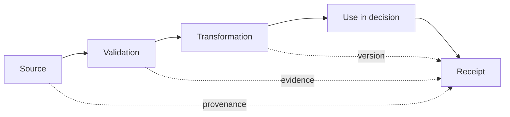

# Data provenance and quality

Trust decisions depend on the origin, transformation, currency, and fitness of data. Provenance evidence SHOULD allow an assessor or affected party to determine who supplied data, under what authority, when it was created or changed, what validation occurred, and which policy version consumed it.

Quality dimensions include accuracy, completeness, timeliness, consistency, validity, uniqueness, and fitness for purpose. A technically authentic record MAY still be unfit for a decision because it is stale, incomplete, out of context, or produced by an incompetent source.
