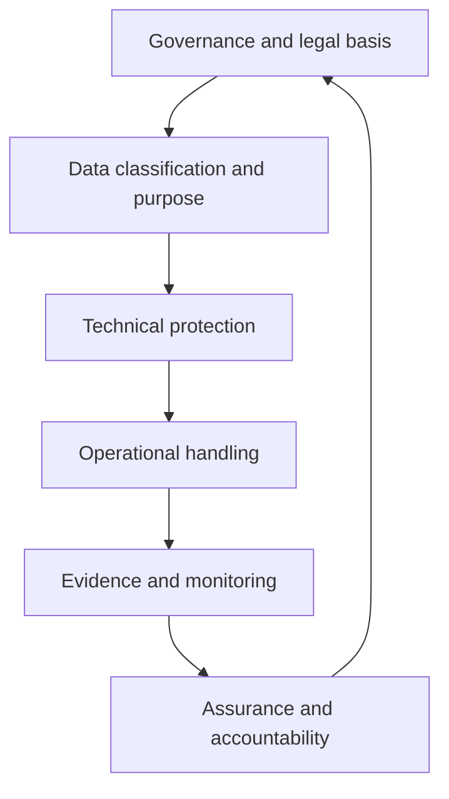

# Data security architecture

## Purpose

Define the outcomes, responsibilities, boundaries, and evidence required to protect ONDTF data throughout its lifecycle.

## Three protection layers

1. **Information security** protects systems and information against compromise.
2. **Data security** protects data throughout creation, use, exchange, storage, retention, and destruction.
3. **Trust-data integrity** protects data whose corruption can change authority, eligibility, assurance, or permitted effect.

## Required outcomes

An ONDTF implementation SHALL define controls for confidentiality, integrity, availability, authenticity, provenance, quality, retention, deletion, recoverability, and accountable access. Controls SHALL be proportionate to the consequence of data compromise, not merely to record volume.

## Responsibility model

Each protected dataset SHOULD have an accountable owner, operational steward, authorised custodians, permitted processors, classification, approved purposes, retention rule, disclosure rule, recovery objective, and evidence requirements. Shared infrastructure does not remove these responsibilities.
