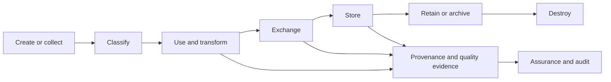

# Data security

ONDTF data security protects information whose loss, disclosure, manipulation, unavailability, or misuse can alter identity, authority, assurance, policy, decision, accountability, or remedy. It therefore extends beyond conventional database protection to **trust-data integrity** across the complete lifecycle.

## Publication set

- [Data Security Architecture](data-security-architecture.md)
- [Trust Data Classification](trust-data-classification.md)
- [Trust Data Lifecycle](trust-data-lifecycle.md)
- [Cryptographic Protection and Key Management](cryptographic-protection-key-management.md)
- [Data Provenance and Quality](data-provenance-quality.md)
- [Retention, Archival and Secure Destruction](retention-destruction.md)
- [Breach Response](breach-response.md)
- [Third-party and Supply-chain Data Governance](third-party-supply-chain.md)

Data security and privacy are related but distinct. Data security protects information and processing. [Privacy](../privacy/) constrains whether and how information should be processed.
