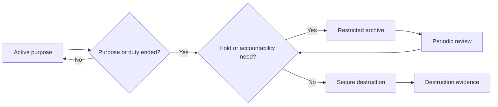

# Retention, archival and secure destruction

Retention SHALL be connected to purpose, legal or governance basis, accountability needs, dispute windows, and minimisation. Indefinite retention by default is not acceptable.

A retention rule SHOULD specify the triggering event, duration, permitted extensions, legal holds, archival conditions, review owner, deletion method, replicas and backups affected, and evidence of completion.

