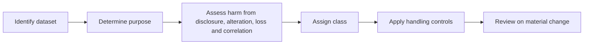

# Trust data classification

ONDTF classifies data by consequence and function rather than by confidentiality alone.

| Class | Examples | Primary concern |
|---|---|---|
| Public trust metadata | published policies, public keys, public status endpoints | integrity, availability, provenance |
| Controlled operational data | participant records, service telemetry, internal policy versions | authorised use, integrity, retention |
| Sensitive trust data | delegation records, evidence bundles, decision receipts | confidentiality, integrity, correlation risk |
| Restricted personal data | identity evidence, biometrics, vulnerable-person records | necessity, strict access, privacy impact |
| Critical authority data | root authority records, signing keys, revocation authority | catastrophic integrity and availability impact |

Classification SHALL consider aggregation and correlation. Individually low-sensitivity records may become highly sensitive when linked across registries, issuers, verifiers, or decision receipts.
