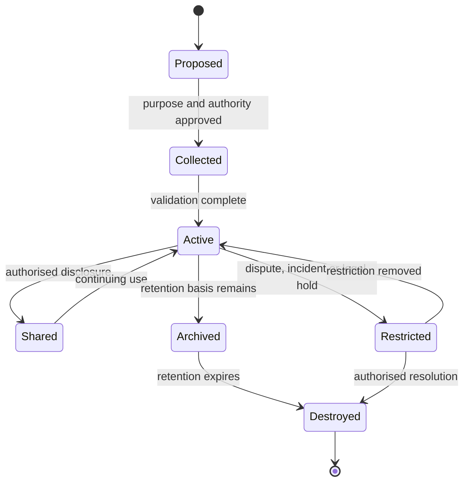

# Trust data lifecycle

A lifecycle record SHOULD identify source, purpose, authority to process, transformations, recipients, storage locations, retention, status, and destruction evidence.

Systems SHALL prevent silent reuse for incompatible purposes. Material changes to purpose, recipient, sensitivity, or risk SHALL trigger reassessment and, where applicable, renewed notice, authorisation, or impact assessment.
