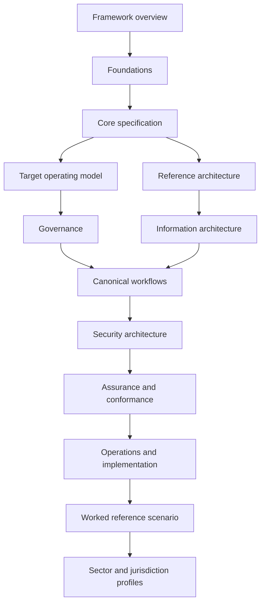

# Framework Map

Use this map to regain orientation and move between the main bodies of ONDTF.

## Three ways through the framework

- **Learn:** follow a curated [learning path](../learning/index.md).
- **Look up:** use the sidebar and search.
- **Validate:** follow the [worked reference scenario](../reference-scenario/index.md) and its evidence package.
