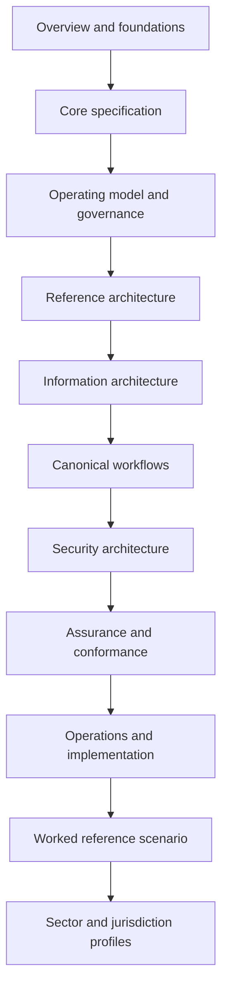

# Canonical Reading Order

The canonical order for acquiring comprehensive knowledge is:

1. Framework overview and foundations
2. Core specification
3. Target operating model and governance
4. Reference architecture
5. Information architecture
6. Canonical workflows
7. Security architecture
8. Assurance and conformance
9. Operations and implementation
10. Worked reference scenario
11. Sector and jurisdiction profiles
12. Programme, decisions, and appendices

This is a **learning dependency order**, not a hierarchy of normative force. Normative status is determined by each document's stated posture and the use of normative language.

