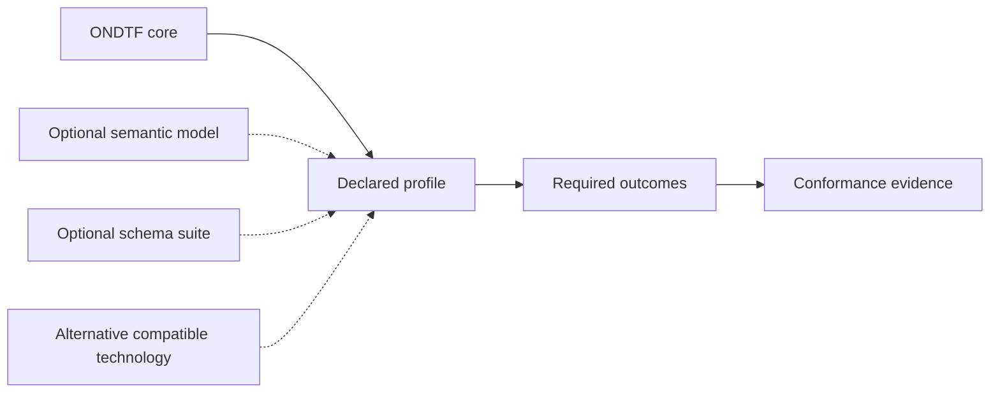

# Framework Independence

ONDTF is intended to provide a baseline for any jurisdiction, public authority, standards body, or multi-sector consortium developing a national digital trust framework. It therefore defines required outcomes and capabilities without requiring adoption of a particular external conceptual model, schema family, protocol suite, registry design, or implementation stack.

## Constitutional principle

> ONDTF is self-contained at the framework level, implementation-neutral at the architecture level, and extensible at the profile level. External models, schemas, and protocols may be used through optional compatibility profiles, but none is required for core ONDTF adoption.

## Core requirements

The ONDTF core independently defines the minimum concepts necessary to describe:

- actors, participants, authorities, and affected parties;
- mandates, delegation, duties, and prohibitions;
- policies, claims, evidence, and assurance;
- registries, discovery, status, and lifecycle;
- decisions, admitted effects, accountability, challenge, and remedy;
- governance, security, privacy, operations, and interoperability.

A reader must be able to interpret and apply these concepts without consulting another repository.

## Outcome-based conformance

Conformance is assessed against observable capabilities, declared profiles, and evidence. A conforming implementation may use any internal model or technical representation that preserves the required ONDTF semantics and behaviours.

A jurisdiction or sector profile may select a specific external model or schema where local interoperability requires it. That selection applies only to the declared profile and does not become a universal ONDTF dependency.

## Optional compatibility resources

[TSMM](https://github.com/sankarshanmukhopadhyay/trust-systems-meta-model) and [TIS](https://github.com/sankarshanmukhopadhyay/trust-infrastructure-schemas) remain useful reference resources:

- TSMM can provide deeper semantic and graph-based formalisation.
- TIS can provide reusable machine-readable artefacts and validation contracts.
- Crosswalks demonstrate compatibility and accelerate implementation.
- Neither project is required to understand, adopt, or conform to ONDTF core.

