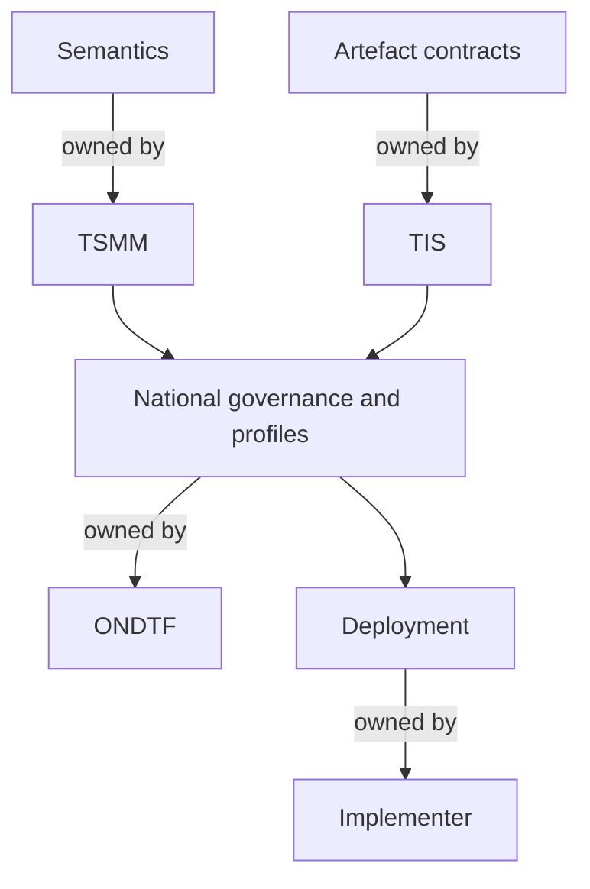

# Concept Ownership Model

| Concept or artefact | Canonical owner | ONDTF responsibility |
|---|---|---|
| Trust-system semantics | TSMM | Select, profile, and trace use in national contexts |
| Authority graph semantics | TSMM | Define national institutional application and mandatory evidence |
| Portable schema identifiers and fields | TIS | Select required artefacts and define profile constraints |
| National institutional roles | ONDTF | Define role, mandate, accountability, and operating relationship |
| Jurisdiction profile | ONDTF/profile authority | Map law, institutions, infrastructure, and national variance |
| Sector profile | ONDTF/profile authority | Define sector actors, risks, workflows, controls, and assurance |
| National conformance policy | ONDTF | Define claim classes, evidence, assessment, and publication |
| Deployment implementation | Implementer | Demonstrate declared profile conformance and operational assurance |

