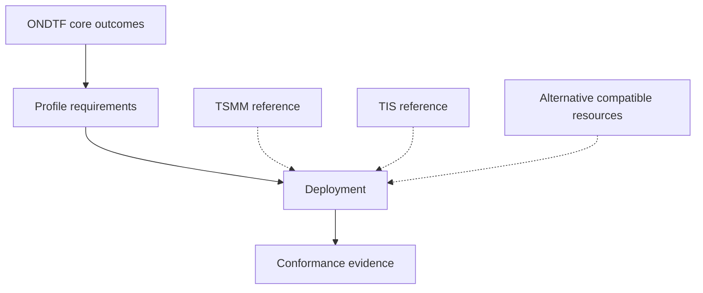

# Concept Ownership Model

| Concept or artefact | Authority | ONDTF treatment |
|---|---|---|
| ONDTF core vocabulary | ONDTF | Defined independently for framework adoption and conformance |
| National institutional architecture | ONDTF and adopting profile authority | Defines mandates, accountability, operating relationships, and safeguards |
| Jurisdiction profile | Profile authority | Maps law, institutions, infrastructure, and national variance |
| Sector profile | Profile authority | Defines sector actors, risks, workflows, controls, and assurance |
| National conformance policy | ONDTF or profile authority | Defines claim classes, evidence, assessment, and publication |
| TSMM concepts | TSMM | Optional compatible reference and semantic crosswalk |
| TIS artefacts | TIS | Optional compatible schema and artefact profile |
| Alternative models and schemas | Their respective authorities | Permitted where equivalent ONDTF outcomes are demonstrated |
| Deployment implementation | Implementer | Demonstrates declared profile conformance and operational assurance |

