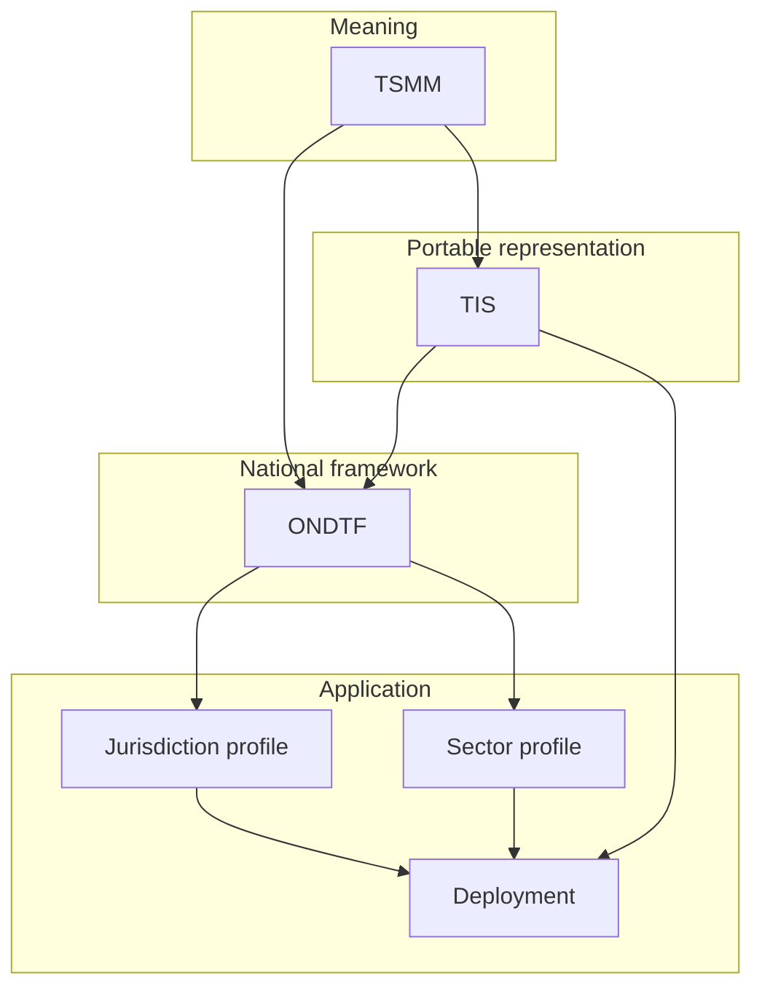

# Portfolio Alignment

## Separation of authority

| Repository | Canonical responsibility | ONDTF usage |
|---|---|---|
| Trust Systems Meta-Model (TSMM) | Semantic and structural model | Adopt or reference concepts for actors, roles, authority, policy, evidence, decisions, effects, lifecycle, accountability, and conformance |
| Trust Infrastructure Schemas (TIS) | Portable schema contracts | Reference schemas and validation semantics for trust records, boundaries, lineage, verification, and evidence |
| ONDTF | National-framework layer | Define governance, sector and jurisdiction profiles, assurance policy, national operations, adoption, and conformance expectations |

## Reuse classification

ONDTF classifies external material as:

- **Adopted:** incorporated and governed within ONDTF;
- **Normatively referenced:** authoritative in its source repository and required by a profile;
- **Informative:** used for explanation or design influence without dependency.

A traceability record must identify the classification, source version, ONDTF location, and divergence policy.

## Initial alignment basis

The seed is informed by TSMM's role as the canonical semantic model and TIS's role as the portable schema-contract layer. No claim is made that ONDTF v0.1.0 fully imports either repository. Formal line-by-line alignment is scheduled for v0.2.0.
