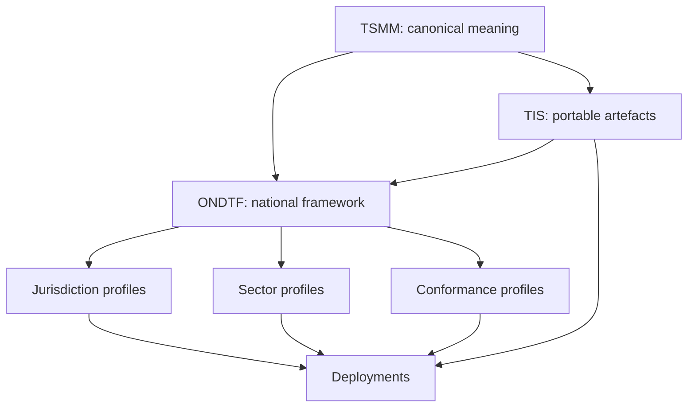

# Portfolio Alignment

## Canonical repositories

| Project | Canonical responsibility | Repository |
|---|---|---|
| Trust Systems Meta-Model (TSMM) | Semantic and structural model | [GitHub](https://github.com/sankarshanmukhopadhyay/trust-systems-meta-model) |
| Trust Infrastructure Schemas (TIS) | Portable machine-readable contracts | [GitHub](https://github.com/sankarshanmukhopadhyay/trust-infrastructure-schemas) |
| Open National Digital Trust Framework (ONDTF) | National-framework, profiling, assurance-policy, adoption, and conformance layer | [GitHub](https://github.com/sankarshanmukhopadhyay/open-national-digital-trust-framework) |

## Reuse classifications

- **Adopted:** incorporated into ONDTF and thereafter governed by ONDTF.
- **Normatively profiled:** remains authoritative in its source repository while ONDTF constrains or requires its use.
- **Informative:** influences explanation or design without creating a conformance dependency.
- **Extended:** adds an ONDTF-owned concept while preserving the source concept's meaning.
- **Excluded:** deliberately outside a profile, with rationale recorded.

The [TSMM semantic crosswalk](tsmm-crosswalk.md), [TIS adoption matrix](tis-adoption.md), and [ownership model](ownership-model.md) provide the v0.2.0 baseline.
